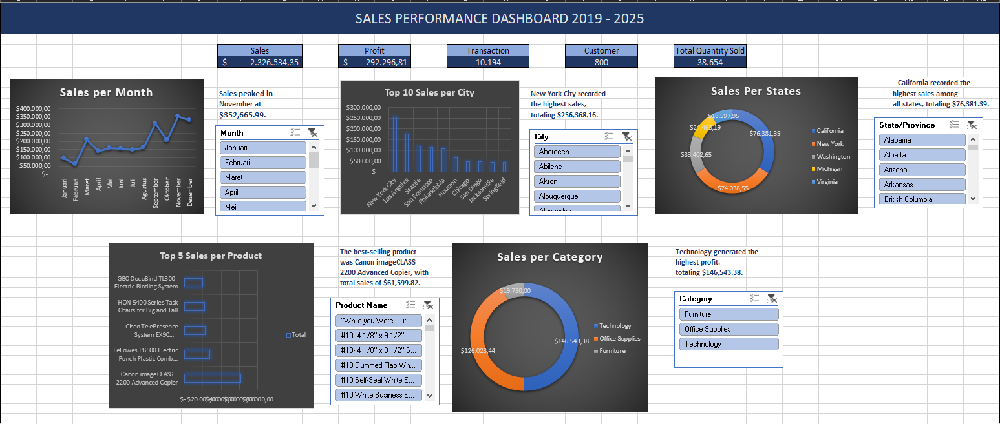

# Sales Performance Dashboard using Microsoft Excel

## Project Overview

This project analyzes sales performance using Microsoft Excel. The dashboard was developed from raw sales data through data cleaning, Pivot Tables, Pivot Charts, KPIs, and interactive Slicers to provide meaningful business insights.

---

## Project Objectives

- Clean and prepare raw sales data.
- Build an interactive sales dashboard.
- Monitor business performance using KPIs.
- Identify sales trends, top-performing products, and profitable regions.
- Provide data-driven business insights.

---

## Tools & Features

- Microsoft Excel
- Pivot Table
- Pivot Chart
- Slicer
- Data Cleaning
- Sorting & Filtering
- KPI Dashboard
- Data Visualization


## Dashboard Preview



## Key Performance Indicators

| KPI | Value |
|------|-------:|
| Total Sales | $2,326,534.35 |
| Total Profit | $292,296.81 |
| Total Transactions | 10,194 |
| Total Customers | 800 |
| Total Quantity Sold | 38,654 |

---

## Key Business Insights

- Sales peaked in **November**, reaching **$352,665.99**.
- New York City recorded the highest sales, totaling **$256,368.16**.
- Canon imageCLASS 2200 Advanced Copier was the top-selling product, generating **$61,599.82** in sales.
- Technology generated the highest profit, totaling **$146,543.38**.
- California recorded the highest profit among all states, totaling **$76,381.39**.

---

## Project Workflow

Raw Data

⬇️

Data Cleaning

⬇️

Sorting & Filtering

⬇️

Pivot Tables

⬇️

Pivot Charts

⬇️

KPI Dashboard

⬇️

Business Insights

---

## Project Structure

```
Sales-Performance-Dashboard/
│
├── README.md
├── Sales Performance Dashboard.xlsx
├── Sample Superstore Dataset.xlsx
└── images
    └── dashboard.png
```

---

## Skills Demonstrated

- Data Cleaning
- Data Analysis
- Pivot Tables
- Pivot Charts
- Dashboard Development
- KPI Design
- Business Analysis
- Data Visualization
- Microsoft Excel

---

## Conclusion

This project demonstrates the ability to transform raw sales data into an interactive dashboard that supports business decision-making through KPI monitoring and data visualization.

---

## Author

**Bagas Triambodo**

Microsoft Excel Portfolio Project
